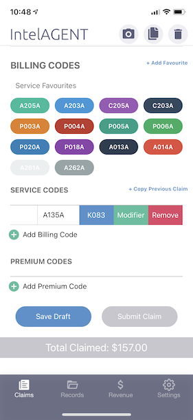

## K081/K082/K083

You can review the [Ministry Bulletin](http://www.health.gov.on.ca/en/pro/programs/ohip/bulletins/4000/bul4745.aspx) for further details. 

## K083 Converter

To quickly calculate the equivalent K083 value of your regular billing codes you can swipe left on the billing code and select the blue "K083" button. The app will automatically convert your regular billing codes into a K083 code of equivalent value (to the nearest $5, according to the ministry rules).

:::tip

The K083 calculator won't automatically incorporate your premiums into the K083 value. The rules for the premiums were decided following the introduction of the K-codes. 

:::

## K083 Premiums

Equivalent Fee Code|Descriptor|Premium
-------------------|----------|---------
E078|Chronic disease assessment premium: Applicable to the following services: medical specific assessment; medical specific re-assessment; complex medical specific re-assessment; partial assessment; or level 2 paediatric assessment by selected medical specialties with specified diagnostic codes.|50%
Automated Age Premiums|Less than 30 days of age|30%
Automated Age Premiums|At least 30 days but less than one year of age|25%
Automated Age Premiums|At least one year but less than two years of age|20%
Automated Age Premiums|At least two years but less than five years of age|15%
Automated Age Premiums|At least five years but less than 16 years of age|10%
Internal Medicine Premium|Eligibility based on 2019 determination and restricted to physicians practicing solely in Internal Medicine (13) on A133, A134, A131 and A138 service claims.|12%
E060|Post renal transplant assessment premium: Restricted to Nephrology (16) on A163, A164, A161 and A168 services claims.|25%
K630|Psychiatric consultation extension|$113.70
K187|Acute post-discharge community psychiatric care|15%
K188|High risk community psychiatric care|15%
K189|Urgent community psychiatric follow-up|$216.30

You can review the [Ministry Bulletin](http://www.health.gov.on.ca/en/pro/programs/ohip/bulletins/4000/bul4764.aspx) for further details. 

## K084 Claims

K084A can only be billed for services where a K083A was billed between March 14, 2020 and August 6, 2020 and the eligible premium amount was not included.

If a Remittance Advice Inquiry (RAI) has already been submitted to adjust a previous claim that included K083A, do not submit a claim for the K084A. The claim will be adjusted through the RAI or bulk adjustment process already received.

A stale date exemption will automatically be applied to K083A and K084A until December 11, 2020 due to the delay in implementation to allow physicians enough time to submit claims.

You can review the [Ministry Bulletin](http://www.health.gov.on.ca/en/pro/programs/ohip/bulletins/redux/bul201003.aspx) for further details. 

## K087/K088/K089 Codes

You can bill these daily K codes on IntelAGENT. Please make sure to add a dummy patient for these claims (Health Card: 9999999999 AA, Name: John Smith DOB: Jan 1, 1975 Sex: Male) so the app will allow you to submit the claim. Once you have done this for one claim you can copy that claim (using the middle button on the top right of the Claims screen) for subsequent claims that need a dummy patient.

The fee billed on the claim should equal the value of the service multiplied by the number of patients serviced. For example, if K087 is claimed for 3 patients seen during the same day, the fee billed should be $71.25 (3 x $23.75).

The number of services for K089 represent the total number of 30 minute intervals spent with all uninsured persons in a single day. For K089A, the current timekeeping rules for psychotherapy remain.

http://www.health.gov.on.ca/en/pro/programs/ohip/bulletins/4000/bul4756.aspx

