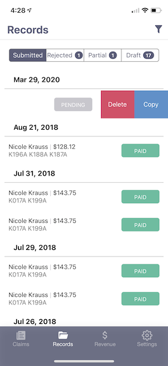

## Deleting a Claim

To delete a claim, if you've entered a duplicate by mistake, you go to the Records tab and swipe left on the claim. A red button will appear with the word "Delete". If you press on that button, the claim will be removed permanently from the system.

:::important

Claims can only be deleted if they're in Pending or Draft Status. 

:::

