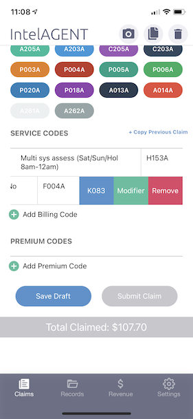
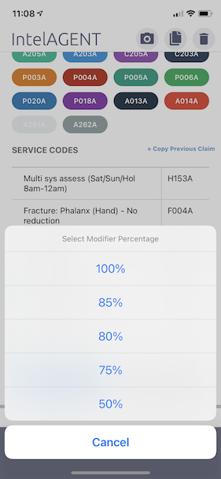

## Billing Codes with Modifiers

There are many times when you’ll want to modify the fee on your billing codes to be a percentage of the regular amount.  For example, when treating fractures that are referring to a Fracture Clinics (75%) or a secondary surgical procedure (85%). IntelAGENT allows you to submit claims with 85%/80%/75%/50% modifications to each billing code by swiping left on the code and selecting modifier. Below is the sequence of steps to select a modifier for the F004A billing code.

