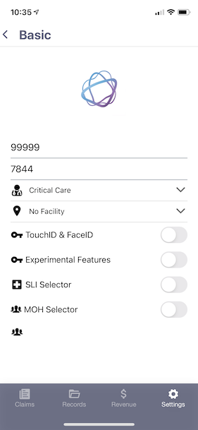

## When To Use SLIs

Claims will sometimes require a Service Location Indicator but we suggest that unless you are receiving rejections you should not chooose a SLI code for your claims. Claims requiring a SLI are becoming more frequent and setting this field resolves the common V68 and W4 errors. Effective for claims with service dates of April 1, 2020 and later, when a technical fee is submitted without a Service Location Indicator (SLI) the entire claim will reject to the physician/group error report with the new error condition ‘VHC: SLI REQUIRED FOR TECH FEE’.

## How To Enable SLIs

In the Settings tab under personal information you can turn on the SLI selector so that claims will have the option to choose an SLI. 

## Chart of Commonly Used SLIs

SLI | Description |	Explanation
| - |  - | - |
HOP	 | Hospital out Patient	| Patient seen in a hospital but was not admitted (i.e. in clinic).
HIP | Hospital in Patient |	In patient in a hospital (including ER) or long-term care facility.
HED	| Hospital Emergency Department	| Emergency room patient that is not admitted.
OTN	| Ontario Telemedicine Network | This doesn't need to be used in IntelAGENT as the app automatically selects this SLI for you behind the scenes when you choose OTN as your facility.
IHF	| Independent Health Facility | Clinic without a facility number.
OFF	| Office of Community Physician | Private Office with no facility code.
HDS	| Hospital Day Surgery | Surgery paitne that is not admitted to the hospital.

:::tip

SLI codes are not required for claims submitted under the “RMB” and “WCB” Payment Program Types. 

:::
