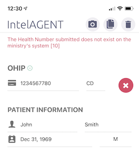

IntelAGENT has an extensive database of billing number for referring physicians. You can billing number for newly practicing physicians not already in our database by tapping the referring physican field in the claims screen to bring up the referring physician menu. If the physician you're looking for isn't in the list then press the icon on the top left of the screen to bring up the "Add Physician" modal where you can add a new physician.

