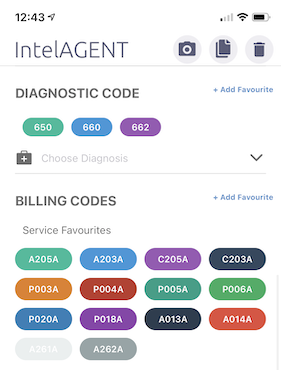

## Billing and Diagnostic Codes Favourites

You can add your customized list of favourites services codes, premium codes and diagnostic codes to the app to make it easy to find them when entering a claim. To the right of the Diagnostic Code and Billing Codes heading in the app there is a small "+ Add Favourites" link to click. A menu will pop up where you can select as many codes as you want to appear on your screen for each new claim.

## Facility Favourites

If you work at mulitple facilities you can use the same user profile for each of them. To add a facility go to the Settings tab and into the Basic Information Screen. If you select the facility field, a menu will appear letting you search for and select multiple Facilities. These facilities will appear at the top of the menu each time you select a new facility in a claim.

## Recents

In addition to all the favourites you can customize, the app also automatically remembers your most recently used billing codes, diagnostic codes and referring physicians and presents them at the top of the list of choices for you. 

