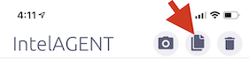
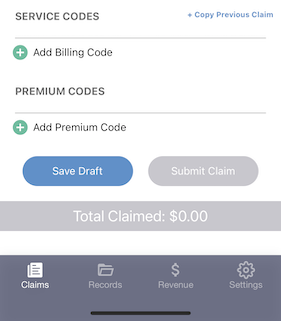

The vast majority of claims submitted by physicians repeat the details over and over again. The physician is either repeating claims for the same patient or the same combinations of codes. Our research has shown that the quickest way to submit a new claim is to make it easy to copy a previously submitted claim. With IntelAGENT you can either duplicate an [entire claim](quick-copy#duplicating-an-entire-claim) or just a [combination of billing codes](quick-copy#copying-billing-codes). For those that find they'd like to just quickly add one or two billing codes then we offer you the option to setup a [quick-push favorites for your billing and diagnostic codes](favourites.md).

## Duplicating an Entire Claim

To duplicate a prior claim you click the middle button in the header: 

A menu will appear showing you your previous claims, including the patient data and billing codes used. You can click a claim and it will be replicated in the claims screen.

:::note

The claim's service date will automatically be updated to today's date when you duplicate an older claims. If you find yourself entering a number of claims for a previous day you can press the "rewind" button on the service date field to automatically choose the date of the last claim submitted.

:::

## Copying Billing Codes

To the right of the "Service Codes" heading in the app there is a small "+ Copy Previous Claim" link to click.

A menu will appear showing you your previous claims, including the patient data and billing codes used. You can click a claim and only the previous claim's billing codes and premium codes will be copied into the current claim.