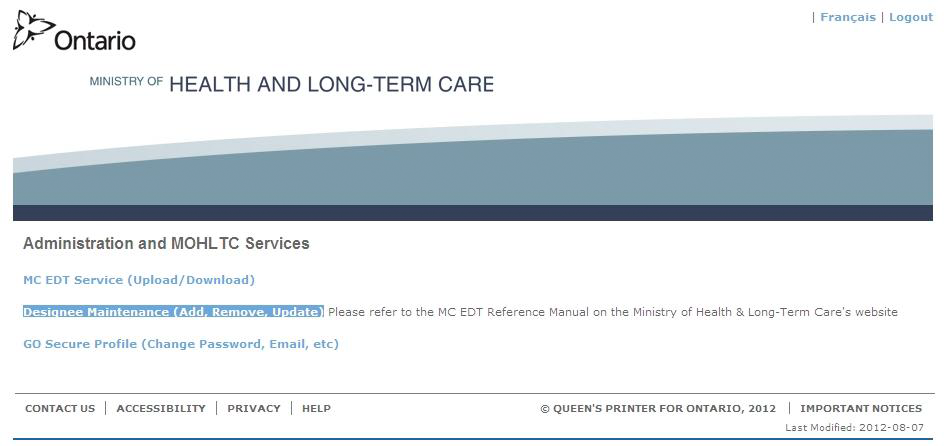
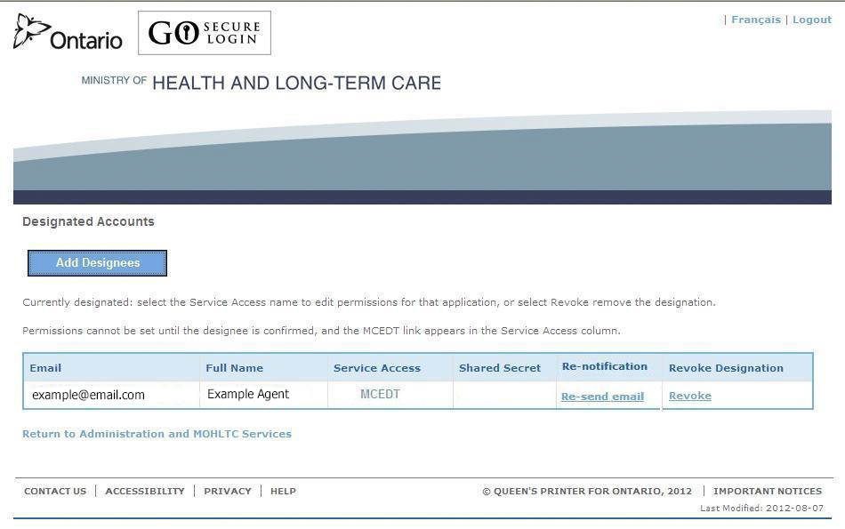
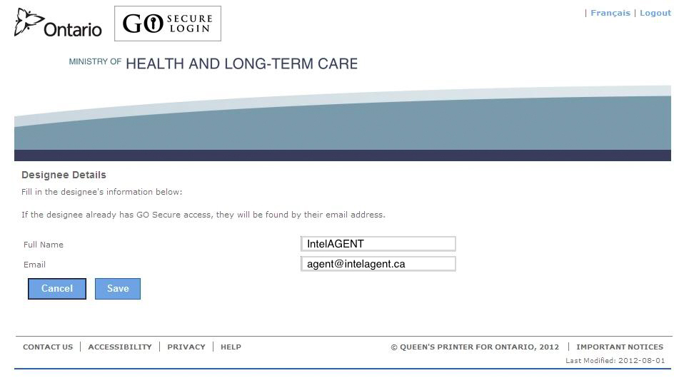
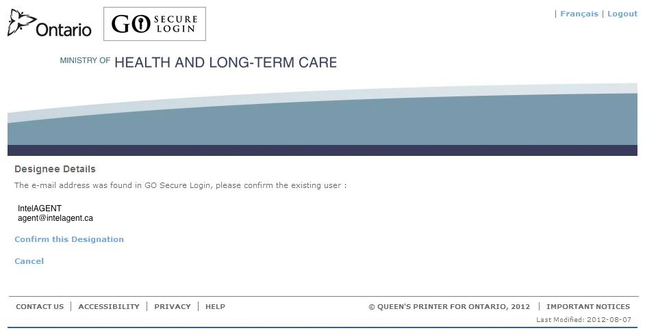
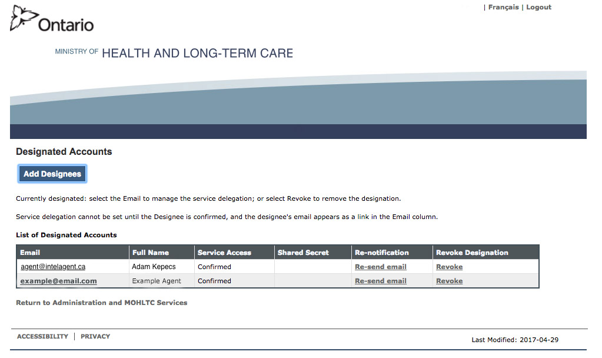
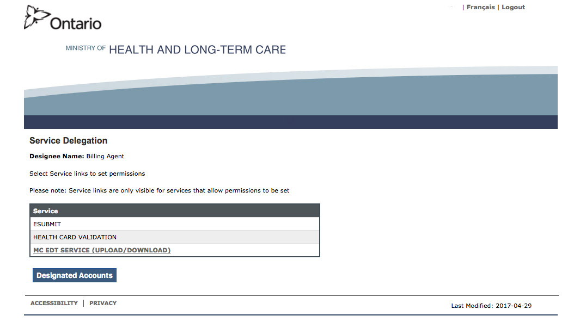
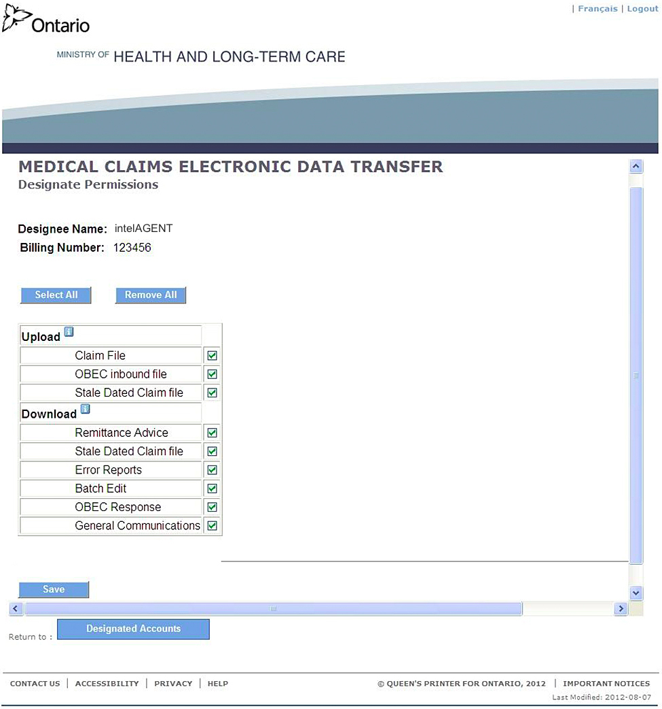

### Log into the [MOHLTC Site](https://www.edt.health.gov.on.ca/) using your GO Secure account.

#### Click the Designee Maintenance link:

#### Click "Add Designee":

#### Enter the Designee Details (Full Name: IntelAGENT, Email: agent@intelagent.ca) and Click Save:

#### Click "Confirm this Designation"

#### You will get an email from GO Secure when intelAGENT has accepted the invitation.

#### Click the link in the email to go to the GO Secure and then click on the "Designee Maintenance" link:

#### Find the row with agent@intelagent.ca in the first column and click on the agent@intelagent.ca hyperlink:

#### Select the MC EDT hyperlink:

#### Click "Select All" and then "Save":

