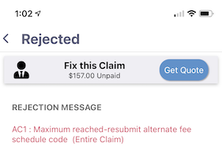
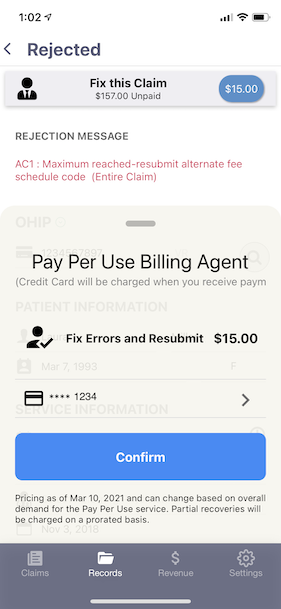

When you select a Rejected and Partial from the Records tab you will see a header on top of the claim asking you if you want a quote from our Pay As You Go Billing Agent Service

If you press "Get Quote" the system  it will generate a quote for you to fix the error. The cost depends on what type of error it is and whether our billing agents are busy with full-service clients or have some extra capacity to take on more work. 

The charge is only applied to your credit card once the ministry has paid you the missing amount. For cases where the full value is not reclaimed then we charge on a pro-rated basis.

